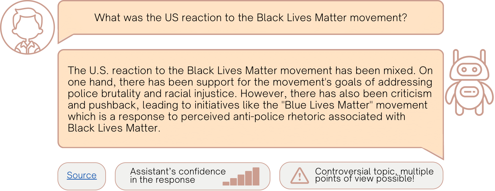

# Explainability for Transparent Conversational Information-Seeking

[](https://github.com/psf/black)

This repository provides resources developed within the following article [[PDF](https://arxiv.org/abs/2405.03303)]:

> W. Łajewska, D. Spina, J. Trippas, and K. Balog. **Explainability for Transparent Conversational Information-Seeking.** In: In: 47th International ACM SIGIR Conference on Research and Development in Information Retrieval (SIGIR ’24), July 2024. [10.1145/3626772.3657768](https://doi.org/10.1145/3626772.3657768)

## Summary

The increasing reliance on digital information necessitates advancements in conversational search systems, particularly in terms of information transparency. While prior research in Conversational Information-Seeking (CIS) has concentrated on retrieval techniques, the challenge remains in crafting responses useful from a user perspective. This study explores different methods of explaining the responses, hypothesizing that transparency about the source of the information, system confidence, and limitations enhances users' ability to objectively assess the response. Exploring transparency along dimensions of explanations type, quality, and presentation modes, this research aims to bridge the gap between system-generated responses and responses verifiable by the user. The user study addresses questions about the impact of the quality of explanations enhancing the response on its usefulness, and the optimal methods for presenting explanations to users. The analysis of the collected data reveals lower user ratings for noisy explanations, although these scores seem insensitive to the quality of the response. Inconclusive results on the explanations presentation format suggest that it may not be a critical factor in this setting. 

## Crowdsourcing-based User Study

We aim to investigate the user's perception of system response quality, quality of explanations, and explanations presentation mode. The study's main goal is to investigate whether explanations provided by the system can make the user's response assessments easier or increase the information's usefulness.



In each crowdsourcing task, crowd workers are presented with ten query-response pairs and asked to assess the response. Responses differ in their quality. Furthermore, they may be enhanced with explanations including source, system’s confidence, and limitations. These explanations differ in terms of quality and can be presented in a visual or textual form.

The methodology, execution, and design of the crowdsourcing experiments are covered in detail [here](crowdsourcing_task_design/README.md).

## Data

We use ten queries selected from TREC CAsT 2020[^1] and 2022[^2] datasets and two manually created responses for each query. Different variants of the responses (perfect and imperfect) and explanations (accurate and noisy) are created manually by one of the authors of the paper. The noise in the responses and explanations is introduced manually using framing.

The data used as an input to our crowdsourcing tasks is covered in detail [here](data/README.md).

## Results

The results of our crowdsourcing tasks and the data analysis are covered in details [here](results/README.md).

## Citation

If you use the resources presented in this repository, please cite:

```
@inproceedings{Lajewska:2024:SIGIR,
	author = {{\L}ajewska, Weronika and Spina, Damiano and Trippas, Johanne and Balog, Krisztian},
	title = {Explainability for Transparent Conversational Information-Seeking},
	year = {2024},
	doi = {10.1145/3626772.3657768},
	url = {https://doi.org/10.1145/3626772.3657768},
	booktitle = {Proceedings of the 47th International ACM SIGIR Conference on Research and Development in Information Retrieval},
	series = {SIGIR ’24}
}
```

## Contact

Should you have any questions, please contact `Weronika Łajewska` at `weronika.lajewska`[AT]uis.no (with [AT] replaced by @).

[^1]: Jeffrey Dalton, Chenyan Xiong, and Jamie Callan. 2020. CAsT 2020: The Conversational Assistance Track Overview. In TREC ’20

[^2]: Paul Owoicho, Jeffrey Dalton, Mohammad Aliannejadi, Leif Azzopardi, Johanne R Trippas, and Svitlana Vakulenko. 2022. TREC CAsT 2022: Going Beyond User Ask and System Retrieve with Initiative and Response Generation. In The Thirty-First Text REtrieval Conference Proceedings (TREC ’22)
