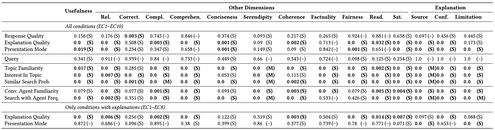
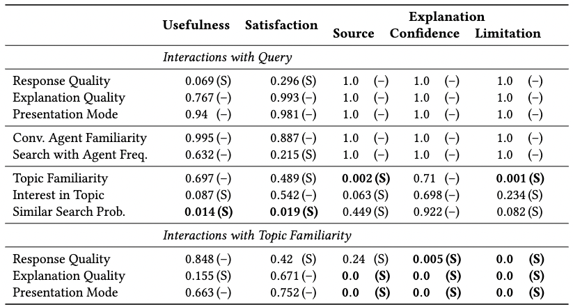
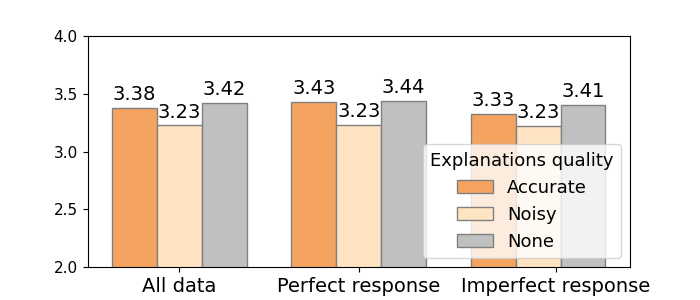
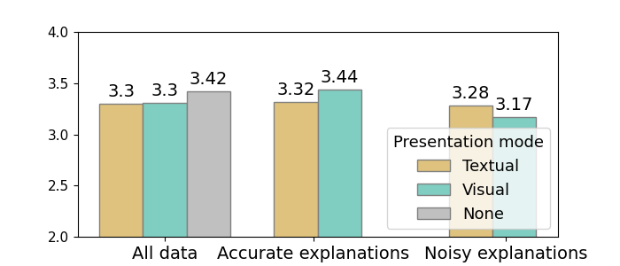
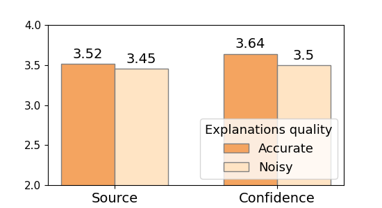
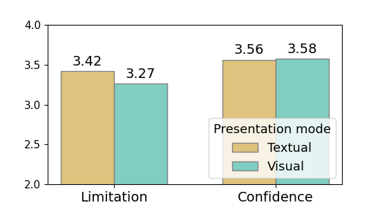
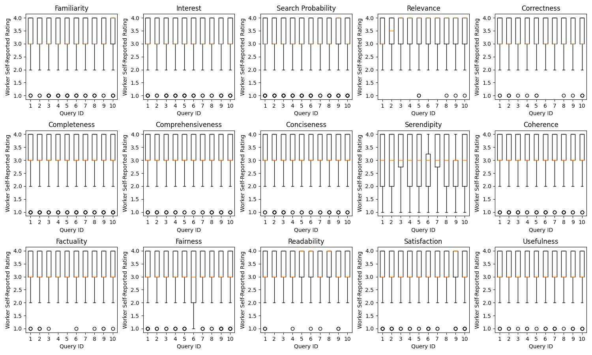

# Results of Quantitative Analysis

The following sections provides the results reported in the paper along with the scripts used to generate the numbers.

## One-way ANOVA

The results are generated using [this script](../../scripts/data_analysis/anova.py) and the following command:

`` python -m scripts.data_analysis.anova --type one-way ``

## Two-way ANOVA

The results are generated using [this script](../../scripts/data_analysis/anova.py) and the following command:

`` python -m scripts.data_analysis.anova --type two-way ``

## Mean scores

Mean scores for response usefulness and explanation user ratings for different quality of the explanations and presentation mode can be generated using [this script](../../scripts/data_analysis/mean_scores.py).

###  Mean response usefulness scores for explanations with different levels of accuracy

###  Mean response usefulness scores for explanations with different presentation modes

###  Mean explanation ratings for explanations with different levels of accuracy

###  Mean explanation ratings for explanations with different presentation modes

Mean scores for other response dimensions for different quality of the explanations and presentation mode can be generated using ....

## Data distribution

The distribution of user-judged response dimensions per query for both user studies can be generated using [this script](../../scripts/data_analysis/data_distribution.py) and the following command:

`` python -m scripts.data_analysis.data_distribution ``

## Demographic information

Demographic information about the crowd workers participating in the user study is presented below:

| Demographic Information | Option | Number of workers |
| --- | --- | --- |
| age | 18-30 | 39 |
| age | 31-45 | 76 |
| age | 46-60 | 41 |
| age | 60+ | 4 |
| age | Prefer not to say | 0 |
| education | High School | 12 |
| education | Bachelor's Degree | 111 |
| education | Master's Degree | 34 |
| education | Ph.D. or higher | 3 |
| education | Prefer not to say | 0 |
| gender | Male | 95 |
| gender | Female | 60 |
| gender | Other | 5 |
| gender | Prefer not to say | 0 |